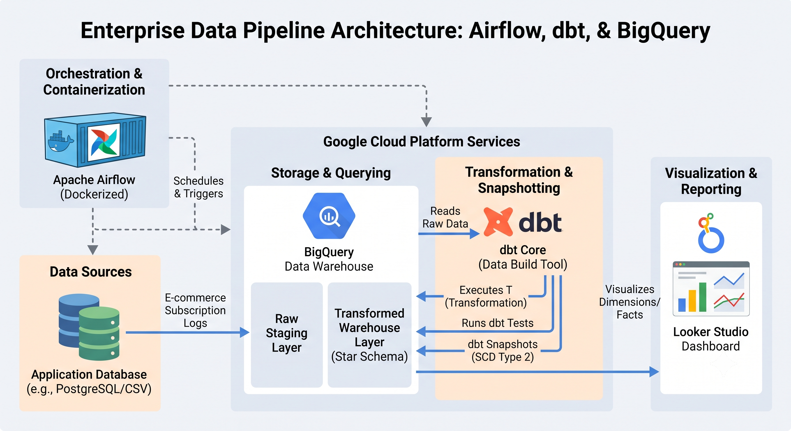

# Enterprise Data Pipeline: Orchestrating dbt with Airflow on Google BigQuery

## Project Overview
This project is an automated, production-ready data pipeline that transforms and tracks customer subscription data. It leverages **Apache Airflow** for orchestration, **dbt (Data Build Tool)** for data transformation and quality testing, and **Google BigQuery** as the cloud data warehouse. 

The pipeline ensures strict data quality and accurately tracks historical changes to user subscriptions over time using **Slowly Changing Dimensions (SCD Type 2)**. The final dimensional models power an interactive dashboard in **Looker Studio** to deliver actionable business intelligence.

---

## Architecture

1. **Orchestration:** Dockerized Apache Airflow schedules, executes, and monitors task dependencies.
2. **Ingestion & Processing:** Custom Python tasks stream dynamic event payloads into BigQuery raw tables.
3. **Transformation & Testing:** dbt executes SQL models to clean, transform, and snapshot raw state transitions.
4. **Storage:** Google BigQuery processes queries and stores the final dimensional schemas.
5. **Visualization:** Looker Studio connects to BigQuery to visualize active subscriptions and customer lifecycle trends.

---

## Key Features
* **Slowly Changing Dimensions (SCD Type 2):** Implemented dbt snapshots to maintain an immutable audit log of user subscription upgrades, downgrades, and cancellations.
* **Automated Data Quality Testing:** Engineered dbt tests (`unique`, `not_null`, `accepted_values`) to enforce schema constraints and catch malformed upstream data.
* **Custom Docker Architecture:** Built a custom Airflow Docker image that isolates Python dependencies cleanly using a virtual environment (`venv`).
* **Cloud Security:** Enforced secure Google Cloud Service Account authentication, keeping credentials safely injected via `.env` files and strictly excluded via `.gitignore`.

---

## Technical Challenges Overcome

### 1. Dependency Conflict Resolution (Airflow vs. dbt)
* **The Problem:** Strict package constraints required by Airflow 2.9.3 conflicted directly with `click` and `google-cloud-aiplatform` dependencies needed by `dbt-bigquery`. This caused the Celery worker to fail health checks and enter an infinite restart loop, leaving tasks permanently queued.
* **The Solution:** Engineered a custom `Dockerfile` to construct an isolated Python Virtual Environment (`venv`) strictly for `dbt-bigquery`. I then created a symlink exposing the `dbt` binary globally to the Airflow user, enabling both frameworks to run on the same container without dependency overlap.

### 2. BigQuery Merge Conflicts on Concurrent Ingestion
* **The Problem:** The initial `dbt snapshot` execution failed with an `UPDATE/MERGE must match at most one source row for each target row` error caused by multiple incoming updates for the same `user_id` arriving within the same execution batch.
* **The Solution:** Redesigned the snapshot source query using a SQL window function CTE (`ROW_NUMBER() OVER (PARTITION BY user_id ORDER BY updated_at DESC)`). This isolated the single latest status change per user per batch prior to executing dbt's BigQuery `MERGE` logic.

---

## Business Intelligence & Analytics

The final transformed dataset powers an interactive Looker Studio dashboard tracking:
* **Customer Lifecycle Trends:** Active vs. churned accounts, upgrade ratios, and plan distribution.
* **Historical Audit Ledger:** Point-in-time subscription status using `dbt_valid_from` and `dbt_valid_to` dimensions.

**[View the Live Looker Studio Report Here](https://datastudio.google.com/reporting/6bcff2dd-8f36-40d3-ad01-0a512c642490)**

---